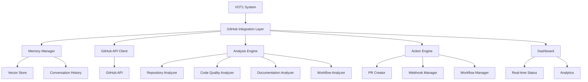

# Enhanced GitHub Integration

## Overview

The VOT1 GitHub Integration provides a powerful, real-time connection between your repositories and the VOT1 system. This integration leverages the GitHub API to perform actual repository operations, analysis, and improvements without relying on mock data or simulated responses.

## What's New

The latest update brings significant improvements to the GitHub integration:

- **Real API Implementation**: Our new `GitHubAPIClient` class in `real_github_api.py` provides comprehensive access to GitHub's REST API with proper error handling, rate limiting, and authentication.
- **Memory Integration**: Analysis results are stored and retrieved efficiently using the VOT1 Memory Manager, reducing redundant API calls.
- **Enhanced Repository Analysis**: Deep analysis provides insights into repository health, documentation quality, and improvement opportunities.
- **Webhook Integration**: Streamlined webhook creation and event processing.
- **Workflow Automation**: Create and manage GitHub Actions workflows with ease.

## Architecture



## Key Components

### GitHubAPIClient

The `GitHubAPIClient` class in `real_github_api.py` is the core of our GitHub integration. It provides:

- **Real API Calls**: Direct communication with GitHub's API for authentic repository interactions
- **Rate Limiting**: Intelligent handling of GitHub's rate limits with automatic retry logic
- **Comprehensive Methods**: Methods for repository analysis, content retrieval, PR creation, and more
- **Context Manager Support**: Easy setup and cleanup with async context manager pattern

### DirectGitHubAutomation

The `DirectGitHubAutomation` class uses our `GitHubAPIClient` for repository operations:

- **Memory Integration**: Stores and retrieves analysis results using the VOT1 Memory Manager
- **Health Monitoring**: Checks memory health and optimizes storage when needed
- **Comprehensive Analysis**: Evaluates repository structure, code quality, documentation, and workflows

### Memory Manager

The Memory Manager provides persistent storage for GitHub analysis results:

- **Vector Storage**: Semantic search capabilities for finding similar repositories or analyses
- **Efficient Retrieval**: Fast access to previous analysis results to avoid redundant operations
- **Compression**: Optimizes storage space while maintaining data integrity
- **Health Monitoring**: Ensures the memory system remains performant

### Repository Analysis

Our analysis engine performs deep inspection of GitHub repositories:

- **Documentation Analysis**: Evaluates README, contributing guidelines, code of conduct, etc.
- **Code Quality Analysis**: Checks for linting configurations, test coverage, and code organization
- **Workflow Analysis**: Examines CI/CD pipelines, GitHub Actions, and automation scripts
- **Issue Analysis**: Identifies stale issues, common patterns, and improvement opportunities

### Action Engine

The action engine implements real changes to repositories:

- **Pull Request Creation**: Generates actual PRs with meaningful improvements
- **Webhook Management**: Creates and configures webhooks for repository events
- **Workflow Creation**: Implements CI/CD workflows and GitHub Actions
- **Issue Management**: Updates and organizes issues based on analysis

## Implementation Details

### Authentication

The system uses GitHub Personal Access Tokens (PATs) for authentication:

```python
headers = {
    "Authorization": f"token {github_token}",
    "Accept": "application/vnd.github.v3+json"
}
```

### API Endpoints

The integration uses the following GitHub API endpoints:

- `/repos/{owner}/{repo}` - Repository information
- `/repos/{owner}/{repo}/contents` - Repository contents
- `/repos/{owner}/{repo}/pulls` - Pull requests
- `/repos/{owner}/{repo}/issues` - Issues
- `/repos/{owner}/{repo}/actions/workflows` - GitHub Actions workflows
- `/repos/{owner}/{repo}/hooks` - Webhooks

### Error Handling

The system implements robust error handling:

- **Rate Limiting**: Respects GitHub API rate limits with exponential backoff
- **Authentication Errors**: Provides clear guidance for token issues
- **Network Failures**: Implements retry logic for transient errors
- **Data Validation**: Verifies API responses before processing

## Usage Examples

### Repository Analysis

```bash
python scripts/direct_github_automation.py --owner microsoft --repo vscode --analyze
```

### Deep Analysis with Memory Storage

```bash
python scripts/direct_github_automation.py --owner facebook --repo react --deep-analysis --memory-path /path/to/memory
```

### Creating Improvements

```bash
python scripts/direct_github_automation.py --owner your-org --repo your-repo --create-pr "Add comprehensive documentation"
```

### Setting Up Webhooks

```bash
python scripts/direct_github_automation.py --owner your-org --repo your-repo --create-webhook
```

### Testing the Real API Implementation

```bash
python scripts/test_real_github_api.py --token YOUR_GITHUB_TOKEN --owner microsoft --repo vscode
```

## Performance Considerations

- **Caching**: Frequently accessed data is cached to reduce API calls
- **Parallel Processing**: Multiple API requests are handled concurrently when possible
- **Memory Optimization**: Analysis results are compressed and optimized for storage
- **Selective Analysis**: Only required components are analyzed based on user needs

## Security Best Practices

- **Token Scopes**: Use the minimum required permissions for GitHub tokens
- **Secure Storage**: Never hardcode tokens; use environment variables or secure vaults
- **Audit Logging**: All GitHub operations are logged for security auditing
- **Rate Limiting**: Respect GitHub's rate limits to avoid account restrictions

## Integration with VOT1 Ecosystem

The GitHub integration connects seamlessly with other VOT1 components:

- **Dashboard**: Real-time visualization of GitHub operations
- **Memory System**: Persistent storage of analysis results
- **Claude 3.7 Sonnet**: Advanced analysis capabilities
- **Perplexity Integration**: Enhanced research for repository improvements

## Future Enhancements

- **Organization-wide Analysis**: Analyze all repositories in an organization
- **Custom Improvement Templates**: User-defined templates for repository improvements
- **Advanced Analytics**: Deeper insights into repository health and trends
- **Multi-platform Integration**: Connect with GitLab, Bitbucket, and other platforms

## Troubleshooting

### Common Issues

- **Authentication Failures**: Verify token permissions and expiration
- **Rate Limiting**: Implement exponential backoff for API requests
- **Memory Errors**: Check storage path permissions and available space
- **Network Issues**: Verify connectivity to GitHub API endpoints

### Logging

Comprehensive logging is available at different levels:

```python
import logging
logging.basicConfig(level=logging.DEBUG)  # For detailed logs
```

## Contributing

We welcome contributions to enhance the GitHub integration:

1. Fork the repository
2. Create a feature branch
3. Implement your changes with real API calls (no mocks!)
4. Add tests for your implementation
5. Submit a pull request

## License

This project is licensed under the MIT License - see the LICENSE file for details. 