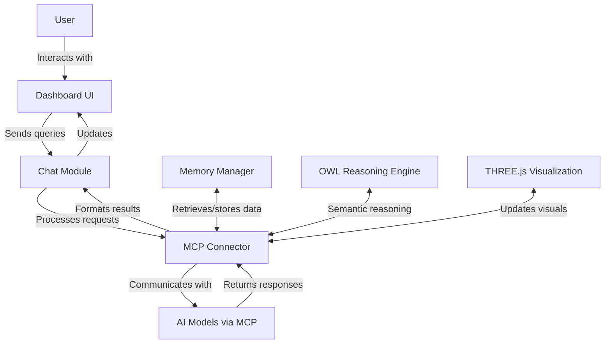
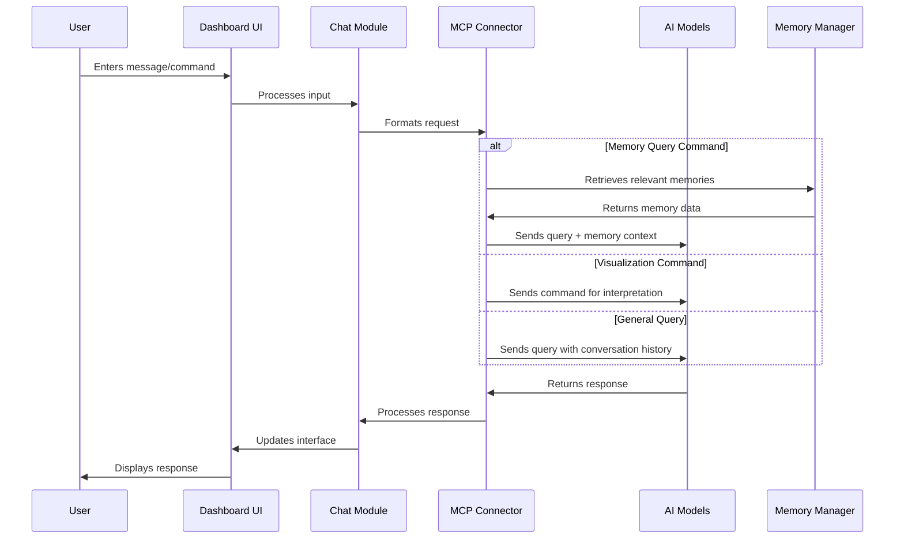
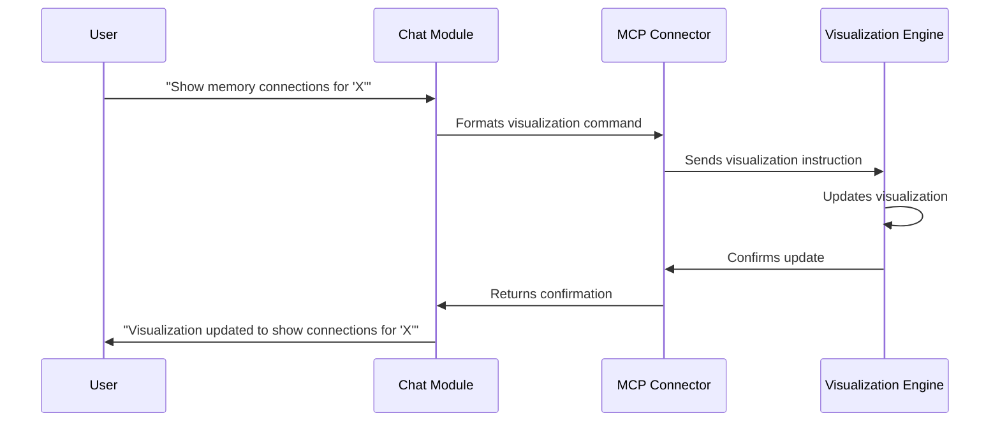
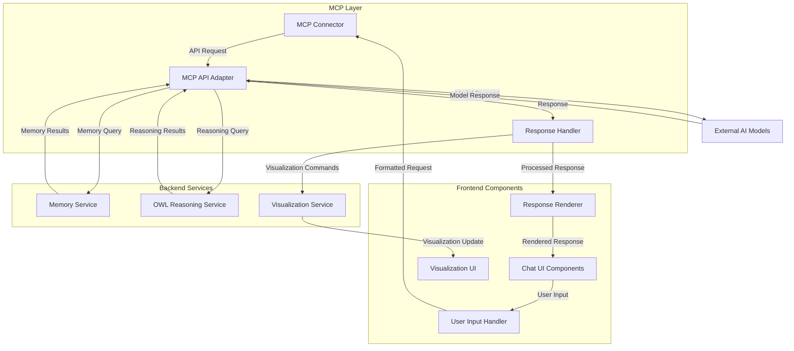

# VOT1 Dashboard AI Chat Architecture

## Overview

The VOT1 Dashboard AI Chat integration provides real-time AI assistance directly within the dashboard interface, leveraging the MCP (Model Control Protocol) for communication with advanced AI models. This feature enables users to query the system's memory, request analysis, and control visualization features through natural language.



## Core Components

### 1. Dashboard UI Chat Interface

- **Chat Panel**: A collapsible/expandable panel that maintains chat history
- **Message Input**: Text input with support for commands and rich text
- **Response Rendering**: Supports markdown, code blocks, and interactive elements
- **State Indicators**: Shows connection status, thinking state, and error states

### 2. Chat Module (Frontend)

- **Message Management**: Handles message queuing, history, and persistence
- **Command Parser**: Recognizes special commands and formats them appropriately
- **Context Management**: Maintains conversation context for coherent interactions
- **UI State Controller**: Manages UI states based on chat interaction

### 3. MCP Connector

- **API Communication**: Handles communication with MCP endpoints
- **Authentication**: Manages authentication tokens and session persistence
- **Rate Limiting**: Implements request throttling to prevent API abuse
- **Error Handling**: Graceful handling of connection issues and API errors

### 4. Backend Integration

- **Memory Integration**: Direct access to search and retrieve system memories
- **OWL Reasoning**: Leverages semantic reasoning for enhanced responses
- **Visualization Control**: Commands to manipulate the THREE.js visualization
- **System Monitoring**: Access to system performance and status metrics

## Data Flow

### 1. User Message Flow



### 2. Visualization Interaction Flow



## API Endpoints

### MCP Communication Endpoints

| Endpoint | Method | Description |
|----------|--------|-------------|
| `/api/chat/message` | POST | Send a new message to the AI |
| `/api/chat/history` | GET | Retrieve chat history |
| `/api/chat/system-prompt` | PUT | Update system prompt for chat context |
| `/api/chat/memory-search` | GET | Search memory based on query |
| `/api/chat/visualization-command` | POST | Execute visualization command |

### Request/Response Format

**Chat Message Request:**
```json
{
  "message": "Show me the most important memories about self-improvement",
  "conversation_id": "conv-123456",
  "include_memory_context": true,
  "visualization_mode": "interactive"
}
```

**Chat Message Response:**
```json
{
  "response": "I found several important memories about self-improvement...",
  "message_id": "msg-789012",
  "conversation_id": "conv-123456",
  "memory_references": [
    {"id": "mem-345678", "relevance": 0.92, "summary": "Self-improvement workflow enhancement"},
    {"id": "mem-456789", "relevance": 0.87, "summary": "Code quality metrics for improvement"}
  ],
  "visualization_update": {
    "command": "highlight",
    "params": {"node_ids": ["mem-345678", "mem-456789"], "color": "#FF5733"}
  }
}
```

## Frontend Implementation

### Dashboard Integration

The chat interface will be integrated into the dashboard as a collapsible panel that can be expanded for full interactions while maintaining visibility of the memory visualization.

#### HTML Structure
```html
<div class="dashboard-container">
  <div class="visualization-panel">
    <!-- THREE.js Visualization -->
  </div>
  
  <div class="chat-panel" id="vot1-chat-panel">
    <div class="chat-header">
      <h3>VOT1 Assistant</h3>
      <button class="toggle-chat-btn">Toggle</button>
    </div>
    
    <div class="chat-messages" id="chat-message-container">
      <!-- Messages will be dynamically inserted here -->
    </div>
    
    <div class="chat-input-container">
      <textarea id="chat-input" placeholder="Ask a question or type a command..."></textarea>
      <button id="chat-send-btn">Send</button>
    </div>
  </div>
</div>
```

#### CSS Styling
```css
.chat-panel {
  position: absolute;
  right: 0;
  bottom: 0;
  width: 350px;
  height: 500px;
  background: rgba(20, 20, 30, 0.85);
  border-left: 1px solid #33ccff;
  border-top: 1px solid #33ccff;
  display: flex;
  flex-direction: column;
  z-index: 100;
  transition: transform 0.3s ease;
}

.chat-panel.collapsed {
  transform: translateX(calc(100% - 40px));
}

.chat-messages {
  flex: 1;
  overflow-y: auto;
  padding: 10px;
}

.message {
  margin-bottom: 10px;
  padding: 8px 12px;
  border-radius: 4px;
}

.message.user {
  background: rgba(40, 40, 60, 0.7);
  align-self: flex-end;
  border-left: 3px solid #6c5ce7;
}

.message.assistant {
  background: rgba(30, 30, 45, 0.7);
  align-self: flex-start;
  border-left: 3px solid #33ccff;
}

.chat-input-container {
  padding: 10px;
  display: flex;
  border-top: 1px solid rgba(80, 80, 120, 0.5);
}

#chat-input {
  flex: 1;
  background: rgba(30, 30, 45, 0.8);
  border: 1px solid #444;
  color: #fff;
  padding: 8px;
  border-radius: 4px;
}
```

#### JavaScript Integration
```javascript
// Dashboard Chat Integration

class DashboardChatController {
  constructor(options = {}) {
    this.apiEndpoint = options.apiEndpoint || '/api/chat/message';
    this.messageContainer = document.getElementById('chat-message-container');
    this.inputField = document.getElementById('chat-input');
    this.sendButton = document.getElementById('chat-send-btn');
    
    this.conversationId = null;
    this.messageHistory = [];
    this.initializeChat();
    this.bindEvents();
  }
  
  initializeChat() {
    // Add welcome message
    this.addMessage({
      role: 'assistant',
      content: 'Welcome to VOT1 Dashboard. Ask me about your memory system or control the visualization.'
    });
    
    // Generate or retrieve conversation ID
    this.conversationId = localStorage.getItem('vot1_conversation_id') || 
      'conv-' + Math.random().toString(36).substring(2, 15);
    localStorage.setItem('vot1_conversation_id', this.conversationId);
    
    // Load any saved history
    const savedHistory = localStorage.getItem('vot1_chat_history');
    if (savedHistory) {
      try {
        const history = JSON.parse(savedHistory);
        history.forEach(msg => this.addMessage(msg, false));
        this.messageHistory = history;
      } catch (e) {
        console.error('Error loading chat history:', e);
      }
    }
  }
  
  bindEvents() {
    this.sendButton.addEventListener('click', () => this.sendMessage());
    this.inputField.addEventListener('keydown', (e) => {
      if (e.key === 'Enter' && !e.shiftKey) {
        e.preventDefault();
        this.sendMessage();
      }
    });
    
    // Toggle chat panel
    document.querySelector('.toggle-chat-btn').addEventListener('click', () => {
      document.getElementById('vot1-chat-panel').classList.toggle('collapsed');
    });
  }
  
  async sendMessage() {
    const message = this.inputField.value.trim();
    if (!message) return;
    
    // Add user message to UI
    this.addMessage({
      role: 'user',
      content: message
    });
    
    // Clear input
    this.inputField.value = '';
    
    // Check for special commands
    if (this.handleSpecialCommands(message)) {
      return;
    }
    
    // Show thinking indicator
    this.addThinkingIndicator();
    
    try {
      // Send to API
      const response = await fetch(this.apiEndpoint, {
        method: 'POST',
        headers: {
          'Content-Type': 'application/json'
        },
        body: JSON.stringify({
          message: message,
          conversation_id: this.conversationId,
          include_memory_context: true
        })
      });
      
      if (!response.ok) {
        throw new Error(`API error: ${response.status}`);
      }
      
      const data = await response.json();
      
      // Remove thinking indicator
      this.removeThinkingIndicator();
      
      // Add assistant response to UI
      this.addMessage({
        role: 'assistant',
        content: data.response,
        memory_references: data.memory_references
      });
      
      // Handle visualization updates if any
      if (data.visualization_update) {
        this.updateVisualization(data.visualization_update);
      }
    } catch (error) {
      console.error('Error sending message:', error);
      this.removeThinkingIndicator();
      this.addMessage({
        role: 'system',
        content: `Error: ${error.message}. Please try again.`
      });
    }
  }
  
  addMessage(message, saveToHistory = true) {
    const messageElement = document.createElement('div');
    messageElement.classList.add('message', message.role);
    
    // Format the message content (handle markdown, code blocks, etc.)
    const formattedContent = this.formatMessageContent(message.content);
    messageElement.innerHTML = formattedContent;
    
    // Add memory references if available
    if (message.memory_references && message.memory_references.length > 0) {
      const referencesElement = document.createElement('div');
      referencesElement.classList.add('memory-references');
      
      const referencesList = document.createElement('ul');
      message.memory_references.forEach(ref => {
        const refItem = document.createElement('li');
        refItem.innerHTML = `<a href="#" data-memory-id="${ref.id}" class="memory-reference">${ref.summary}</a> (${(ref.relevance * 100).toFixed(0)}%)`;
        referencesList.appendChild(refItem);
      });
      
      referencesElement.appendChild(document.createElement('hr'));
      const referencesTitle = document.createElement('div');
      referencesTitle.textContent = 'Related Memories:';
      referencesTitle.classList.add('references-title');
      referencesElement.appendChild(referencesTitle);
      referencesElement.appendChild(referencesList);
      messageElement.appendChild(referencesElement);
    }
    
    this.messageContainer.appendChild(messageElement);
    this.messageContainer.scrollTop = this.messageContainer.scrollHeight;
    
    if (saveToHistory) {
      this.messageHistory.push(message);
      localStorage.setItem('vot1_chat_history', JSON.stringify(this.messageHistory));
    }
  }
  
  addThinkingIndicator() {
    const indicator = document.createElement('div');
    indicator.classList.add('message', 'assistant', 'thinking');
    indicator.innerHTML = '<div class="typing-indicator"><span></span><span></span><span></span></div>';
    indicator.id = 'thinking-indicator';
    this.messageContainer.appendChild(indicator);
    this.messageContainer.scrollTop = this.messageContainer.scrollHeight;
  }
  
  removeThinkingIndicator() {
    const indicator = document.getElementById('thinking-indicator');
    if (indicator) {
      indicator.remove();
    }
  }
  
  formatMessageContent(content) {
    // This would be replaced with a proper markdown renderer
    // For now, we'll do some basic formatting
    
    // Handle code blocks
    content = content.replace(/```(\w+)?\n([\s\S]+?)\n```/g, (match, language, code) => {
      const lang = language || '';
      return `<pre><code class="language-${lang}">${this.escapeHtml(code)}</code></pre>`;
    });
    
    // Handle inline code
    content = content.replace(/`([^`]+)`/g, '<code>$1</code>');
    
    // Handle bold text
    content = content.replace(/\*\*([^*]+)\*\*/g, '<strong>$1</strong>');
    
    // Handle italic text
    content = content.replace(/\*([^*]+)\*/g, '<em>$1</em>');
    
    // Convert line breaks to <br>
    content = content.replace(/\n/g, '<br>');
    
    return content;
  }
  
  escapeHtml(text) {
    const div = document.createElement('div');
    div.textContent = text;
    return div.innerHTML;
  }
  
  handleSpecialCommands(message) {
    // Check for visualization commands
    if (message.startsWith('/viz')) {
      const command = message.substring(5).trim();
      
      if (command.startsWith('focus')) {
        const param = command.substring(6).trim();
        this.updateVisualization({
          command: 'focus',
          params: { query: param }
        });
        
        this.addMessage({
          role: 'system',
          content: `Focusing visualization on "${param}"`
        });
        return true;
      }
      
      if (command.startsWith('reset')) {
        this.updateVisualization({
          command: 'reset'
        });
        
        this.addMessage({
          role: 'system',
          content: 'Visualization reset to default view'
        });
        return true;
      }
    }
    
    // Check for memory commands
    if (message.startsWith('/memory')) {
      const command = message.substring(8).trim();
      
      if (command.startsWith('search')) {
        const query = command.substring(7).trim();
        this.executeMemorySearch(query);
        return true;
      }
    }
    
    return false;
  }
  
  updateVisualization(update) {
    // This function would integrate with the THREE.js visualization
    // For now, we'll just log the command
    console.log('Visualization update:', update);
    
    // In actual implementation, we would call dashboardState.applyVisualizationCommand(update)
    if (window.dashboardState && typeof window.dashboardState.applyVisualizationCommand === 'function') {
      window.dashboardState.applyVisualizationCommand(update);
    }
  }
  
  async executeMemorySearch(query) {
    this.addThinkingIndicator();
    
    try {
      const response = await fetch(`/api/chat/memory-search?q=${encodeURIComponent(query)}`);
      const data = await response.json();
      
      this.removeThinkingIndicator();
      
      if (data.results && data.results.length > 0) {
        let resultContent = `**Memory search results for "${query}":**\n\n`;
        
        data.results.forEach((item, index) => {
          resultContent += `${index + 1}. **${item.metadata.title || 'Untitled Memory'}**\n`;
          resultContent += `   ${item.content.substring(0, 100)}...\n\n`;
        });
        
        this.addMessage({
          role: 'assistant',
          content: resultContent,
          memory_references: data.results.map(item => ({
            id: item.id,
            summary: item.metadata.title || 'Untitled Memory',
            relevance: item.score || 1.0
          }))
        });
        
        // Update visualization to highlight these memories
        this.updateVisualization({
          command: 'highlight',
          params: {
            node_ids: data.results.map(item => item.id)
          }
        });
      } else {
        this.addMessage({
          role: 'assistant',
          content: `No memories found matching "${query}".`
        });
      }
    } catch (error) {
      console.error('Memory search error:', error);
      this.removeThinkingIndicator();
      this.addMessage({
        role: 'system',
        content: `Error searching memories: ${error.message}`
      });
    }
  }
}

// Initialize the chat when the dashboard is loaded
document.addEventListener('DOMContentLoaded', () => {
  // Make sure the dashboard is fully initialized first
  window.addEventListener('dashboard:initialized', () => {
    window.dashboardChat = new DashboardChatController({
      apiEndpoint: '/api/chat/message'
    });
  });
  
  // If no event is triggered, initialize after a short delay
  setTimeout(() => {
    if (!window.dashboardChat) {
      window.dashboardChat = new DashboardChatController({
        apiEndpoint: '/api/chat/message'
      });
    }
  }, 1000);
});
```

## Backend Implementation

### MCP Integration

The backend will need to connect to MCP to process the user queries. Here's the outline for the Flask API endpoints to handle this:

```python
from flask import Flask, request, jsonify
from src.vot1.vot_mcp import VotModelControlProtocol
from src.vot1.memory import MemoryManager
import asyncio
import json
import uuid

app = Flask(__name__)
mcp = VotModelControlProtocol()
memory_manager = MemoryManager()

@app.route('/api/chat/message', methods=['POST'])
def process_chat_message():
    data = request.json
    message = data.get('message', '')
    conversation_id = data.get('conversation_id', f'conv-{uuid.uuid4()}')
    include_memory = data.get('include_memory_context', True)
    
    # Get conversation history from storage
    conversation_history = get_conversation_history(conversation_id)
    
    # If memory context is requested, retrieve relevant memories
    memory_context = None
    if include_memory:
        memory_context = get_memory_context(message)
    
    # Process with MCP
    response = asyncio.run(process_with_mcp(message, conversation_history, memory_context))
    
    # Save the updated conversation
    save_conversation(conversation_id, {
        'role': 'user',
        'content': message
    })
    save_conversation(conversation_id, {
        'role': 'assistant',
        'content': response.get('content', '')
    })
    
    # Format the response
    formatted_response = {
        'response': response.get('content', ''),
        'message_id': f'msg-{uuid.uuid4()}',
        'conversation_id': conversation_id,
        'memory_references': response.get('memory_references', []),
        'visualization_update': response.get('visualization_update')
    }
    
    return jsonify(formatted_response)

async def process_with_mcp(message, conversation_history, memory_context=None):
    """Process a message with MCP and return the response."""
    system_prompt = get_system_prompt(memory_context)
    
    # Format conversation history for MCP
    formatted_history = format_conversation_history(conversation_history)
    
    # Create the request for MCP
    request_data = {
        'prompt': message,
        'system': system_prompt,
        'context': {
            'conversation': formatted_history
        },
        'max_tokens': 1024
    }
    
    # If we have memory context, add it
    if memory_context and memory_context.get('items'):
        request_data['context']['memories'] = memory_context.get('items')
    
    # Process with MCP
    response = await mcp.process_request_async(**request_data)
    
    # Extract visualization commands if any
    visualization_update = extract_visualization_commands(response.get('content', ''))
    
    # Prepare final response
    result = {
        'content': response.get('content', ''),
        'memory_references': format_memory_references(memory_context)
    }
    
    # Add visualization update if found
    if visualization_update:
        result['visualization_update'] = visualization_update
    
    return result

def get_system_prompt(memory_context=None):
    """Generate the system prompt based on context."""
    base_prompt = """
    You are VOT1 Assistant, an AI that helps users interact with the VOT1 memory system and dashboard.
    - You can provide information about memories in the system
    - You can help control the visualization by suggesting commands
    - You should provide concise and helpful responses
    - When mentioning specific memories, include their ID for reference
    """
    
    if memory_context and memory_context.get('items'):
        base_prompt += "\n\nI'm providing you with relevant memories from the system based on the user's query:"
        for i, item in enumerate(memory_context.get('items', [])[:3]):
            base_prompt += f"\n\nMemory {i+1} [ID: {item.get('id', 'unknown')}]:\n{item.get('content', '')[:200]}..."
    
    return base_prompt

def get_memory_context(query, max_items=5):
    """Retrieve relevant memories based on the query."""
    try:
        results = memory_manager.search_semantic_memory(
            query=query,
            num_results=max_items
        )
        
        items = []
        for item in results:
            items.append({
                'id': item.id,
                'content': item.content,
                'metadata': item.metadata,
                'score': item.score
            })
        
        return {
            'query': query,
            'items': items
        }
    except Exception as e:
        print(f"Error retrieving memory context: {e}")
        return {'query': query, 'items': []}

def format_memory_references(memory_context):
    """Format memory references for the response."""
    if not memory_context or not memory_context.get('items'):
        return []
    
    references = []
    for item in memory_context.get('items', []):
        references.append({
            'id': item.get('id', ''),
            'relevance': item.get('score', 0.7),
            'summary': item.get('metadata', {}).get('title', 'Memory') 
        })
    
    return references

def extract_visualization_commands(content):
    """Extract visualization commands from the response text."""
    # This would be a more sophisticated parser in practice
    # For now, we'll use a simple check for command patterns
    
    if '[VISUALIZATION:' in content:
        try:
            # Extract the command
            start = content.find('[VISUALIZATION:')
            end = content.find(']', start)
            command_str = content[start+15:end].strip()
            
            # Parse the command
            command_data = json.loads(command_str)
            return command_data
        except Exception as e:
            print(f"Error extracting visualization command: {e}")
    
    return None

# Conversation history storage (would be a database in production)
conversation_store = {}

def get_conversation_history(conversation_id, max_length=10):
    """Get the conversation history for a given ID."""
    return conversation_store.get(conversation_id, [])[-max_length:]

def save_conversation(conversation_id, message):
    """Save a message to the conversation history."""
    if conversation_id not in conversation_store:
        conversation_store[conversation_id] = []
    
    conversation_store[conversation_id].append(message)
    # In production, this would be saved to a database
    
def format_conversation_history(history):
    """Format conversation history for MCP."""
    return [
        {'role': item.get('role', 'user'), 'content': item.get('content', '')}
        for item in history
    ]

@app.route('/api/chat/memory-search', methods=['GET'])
def memory_search():
    """Search memories based on query."""
    query = request.args.get('q', '')
    if not query:
        return jsonify({'error': 'Query parameter required'}), 400
    
    memory_context = get_memory_context(query, max_items=10)
    
    return jsonify({
        'query': query,
        'results': memory_context.get('items', [])
    })

if __name__ == '__main__':
    app.run(debug=True)
```

## MCP Integration Architecture



## Implementation Phases

### Phase 1: Basic Chat Integration
- Implement chat UI in dashboard
- Set up basic backend API endpoints
- Establish MCP connection
- Support simple memory queries

### Phase 2: Memory Integration
- Add memory search and context
- Implement memory references in responses
- Create direct links to memories in visualization

### Phase 3: Visualization Control
- Add commands to control visualization
- Implement automatic visualization updates based on chat
- Support interactive memory exploration

### Phase 4: Advanced Features
- Add OWL reasoning integration
- Support file search and code exploration
- Implement system monitoring and status reporting
- Add custom user commands and shortcuts

## Testing and Evaluation

### Automated Testing
- Unit tests for chat components and endpoints
- Integration tests for MCP interaction
- Visual regression tests for UI components

### User Evaluation Metrics
- Response time and latency
- Query success rate
- Memory retrieval relevance
- Visualization command accuracy
- Overall user satisfaction

## Conclusion

The VOT1 Dashboard AI Chat integration leverages MCP to provide a powerful and intuitive interface for interacting with the memory system and visualization. By combining natural language processing with direct system access, users can explore memories, control visualization, and gain insights with unprecedented ease.

This architecture provides a comprehensive blueprint for implementation while maintaining flexibility for future enhancements and customization. 