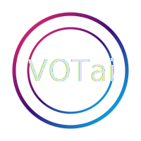

# VOTai TRILOGY BRAIN - Cyberpunk Dashboard

<div align="center">
  
  <h3>Advanced Memory Management System Dashboard</h3>
  <p>Powered by <a href="https://villageofthousands.io">VillageOfThousands.io</a></p>
</div>

## Overview

The VOTai TRILOGY BRAIN dashboard is a cyberpunk-styled interface for interacting with the advanced memory management system. It provides a powerful visual representation of memory nodes, their connections, and system performance metrics in a retro-futuristic terminal aesthetic.

### Key Features

- **Interactive 3D Memory Visualization**: Explore memory connections in a force-directed THREE.js visualization
- **Command Terminal Interface**: Control system operations through a retro terminal
- **Performance Metrics**: Real-time charts tracking system performance
- **Zero-Knowledge Verification**: Monitor and verify memory integrity with ZK proofs
- **IPFS Integration**: Track decentralized storage status
- **Tokenomics Dashboard**: Monitor the VOTai token economy

## Technical Stack

- **Front-end**: HTML5, CSS3, JavaScript
- **3D Visualization**: THREE.js with custom particle effects
- **Charts**: Chart.js with cyberpunk styling
- **Animation**: GSAP for smooth transitions
- **Modern UI**: CSS Grid layout with responsive design
- **Terminal**: Custom-built terminal emulator with command history

## Project Structure

```
dashboard/
├── assets/             # Images and static assets
├── css/                # Stylesheets
│   ├── cyberpunk.css   # Base cyberpunk styling
│   ├── dashboard.css   # Dashboard layout
│   ├── terminal.css    # Terminal component styling
│   └── modern-effects.css # Modern UI effects
├── js/
│   ├── memory-network.js    # THREE.js memory visualization
│   ├── terminal.js          # Terminal component
│   ├── charts.js            # Performance charts
│   ├── dashboard.js         # Main dashboard controller
│   ├── memory-integration.js # Memory system integration
│   ├── modern-ui.js         # Modern UI effects
│   └── dashboard-fix.js     # Bug fixes and compatibility
├── index.html          # Production dashboard
├── debug.html          # Debug version with developer tools
└── README.md           # This documentation file
```

## Installation & Setup

1. Ensure you have a modern web browser with WebGL support
2. Clone the repository
3. Serve the files using a local web server

```bash
# Using Python's built-in server
python -m http.server 8000
```

4. Access the dashboard at http://localhost:8000/src/vot1/ui/dashboard/

## Usage

### Memory Visualization

The 3D memory visualization displays memories as nodes with connections representing relationships. Node colors indicate:

- **Pink**: L1 (most recent/important memories)
- **Cyan**: L2 (medium-term memories)
- **Purple**: L3 (long-term memories)

Controls:
- Mouse drag to rotate the view
- Mouse wheel to zoom
- Click on a node to view memory details

### Terminal Commands

The terminal interface accepts the following commands:

- `help` - Show available commands
- `clear` - Clear the terminal
- `status` - Show system status
- `memory help` - Show memory-specific commands
- `memory status` - Display memory system status
- `memory search <query>` - Search for memories
- `memory generate <count>` - Generate test memories
- `memory refresh` - Refresh the memory visualization
- `memory zk <id>` - Verify a memory with a ZK proof
- `ipfs status` - Show IPFS connection status
- `token balance` - Show VOTai token balance

### Dashboard Controls

- **Connect Wallet** - Toggles wallet connection for token operations
- **Toggle View** - Switches between memory visualization and analytics
- **Visualization Mode** - Changes the 3D visualization type
- **Detail Level** - Adjusts the amount of detail shown in the visualization

## Integration with Memory System

The dashboard integrates with the TRILOGY BRAIN memory system through:

1. **Memory API**: Connects to the `ComposioMemoryBridge` or uses a mock implementation
2. **ZK Verification**: Verifies memory integrity using zero-knowledge proofs
3. **IPFS Connection**: Monitors decentralized storage status
4. **Token Economy**: Tracks VOTai token balance and operations

## Development Mode

For development and debugging:

1. Access the debug version at http://localhost:8000/src/vot1/ui/dashboard/debug.html
2. Use the debug panel to:
   - Check component loading status
   - Test individual components
   - View error logs
   - Apply bug fixes

## Technical Notes

### THREE.js Memory Visualization

The memory network visualization uses:
- Custom particle system for background effects
- Force-directed layout for automatic node positioning
- Instanced geometry for improved performance with many nodes
- Custom shader materials for glow effects

### Modern UI Elements

The dashboard implements modern UI elements inspired by:
- Perplexity AI's clean, functional interface
- Cursor AI's editor styling
- Cyberpunk aesthetic with neon highlights and terminal design

### Performance Considerations

- Animation frames are throttled when tab is inactive
- THREE.js resources are properly disposed to prevent memory leaks
- WebGL context is managed carefully to avoid GPU memory issues
- Lazy loading of heavy components improves initial load time

## Browser Compatibility

- **Recommended**: Chrome/Edge (latest), Firefox (latest)
- **Minimum**: Browsers with WebGL 2.0 support
- **Mobile**: Responsive design works on modern mobile browsers, but desktop experience is recommended

## License & Credits

- **VOTai TRILOGY BRAIN** is © 2024 VillageOfThousands.io
- THREE.js by Three.js Authors (MIT License)
- Chart.js by Chart.js Contributors (MIT License)
- GSAP by GreenSock (Standard License)

---

<div align="center">
  <p>Made with 💜 by the VOTai team</p>
</div> 